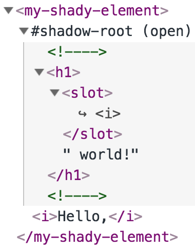
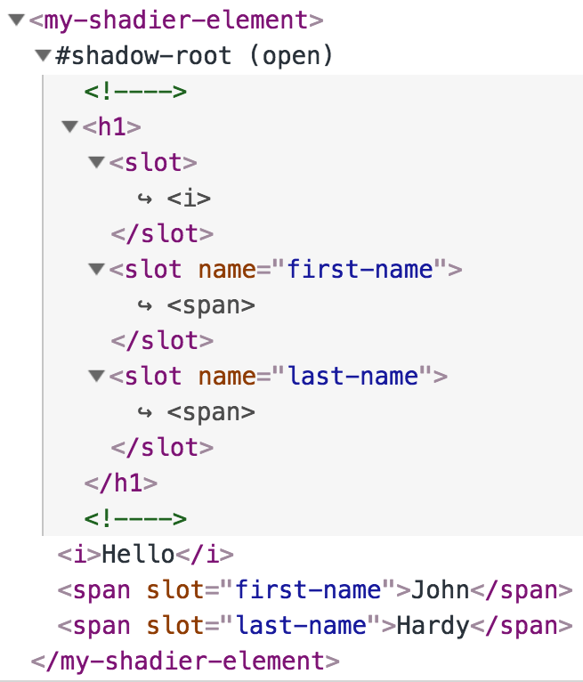

# Shadow DOM
## What on Earth is the Shadow DOM?

Normally, an HTML element renders itself and all the child elements in its body. For example, the following element renders a `div` and its content.

    
John Hardy

If we access the DOM element and attach a special structure to it known as a `shadowRoot`, the element will render this structure instead of its content. 

    const elem = document.getElementById('name-card');
    elem.attachShadow({mode: 'open'});
    elem.shadowRoot.innerHTML = `
      This shadow content replaces my body content
    `;

The content that is effectively rendered looks like this:

    

      This shadow content replaces my body content
    

So now our original body content is completely hidden and all we see is this shadow content.

If we go a bit further we can integrate our original body content into the shadow content by using a shadow DOM concept called a `slot`. 

    const elem = document.getElementById('name-card');
    elem.attachShadow({mode: 'open'});
    elem.shadowRoot.innerHTML = `
      My name is <i><slot></slot></i>
    `;

You can think of a `slot` as being a bit like a *symbolic link* which links back to your body content renders it right in the middle of the Shadow DOM content. Nothing actually is moved but the `slot` will display the body content of the element in place.

The element is now effectively rendered like this:

    
My name is <i>John Hardy</i>

multi slots!!!!!!!!!!!!!!!!!!!!!!!!!!!!!!

Returning now to custom elements, normally the element has its `shadowRoot` attached during its construction. The body content of the element becomes invisible and the `shadowRoot` and its child elements will be display instead. The body content is still accessible to the element, however, and can be used for any other purpose.

The HTML elements inside the element’s Shadow DOM are isolated from the elements outside and can be styled and controlled independently of everything else on the page.

Given the following custom element

    <my-shady-element>
      <i>Hello</i>
    </my-shady-element>

You can see that the element contains the body content

    <i>Hello</i>

Because this component will be defined to have a Shadow DOM this content won’t get displayed directly.

Let’s turn now to the component’s definition.

    class MyShadyElement extends HTMLElement {
      
      constructor() { 
        super();
        this.attachShadow({mode: 'open'});   
        this.shadowRoot.innerHTML = `
          <h1>
            <slot></slot> world!
          </h1>
        `;
      }
    }
      
    customElements.define('my-shady-element', MyShadyElement);

[See a working version here (use Chrome).](https://codepen.io/jhlagado/pen/GXLxGm?editors=1101)

When this component gets constructed, it calls makes a call to its `super` class before calling its inherited `attachShadow` method. This attaches a Shadow DOM to the element and puts the root of this structure in a property called `shadowRoot`. We then add the content to the innerHTML of the `shadowRoot` rather than to the element body itself.

Taking a closer look at the HTML markup that appears in the browser

the first thing to notice is that the element has a special child marked #shadow-root which contains all of the DOM that will be rendered. The actual body of the custom element is not rendered directly but it does get referenced by the Shadow DOM via a special place-holder tag called `slot`.

    <h1>
      <slot></slot> world!
    </h1>

So when we use a custom element

    <my-shady-element>
      <i>Hello</i>
    </my-shady-element>

The `slot` will refer to `<i>Hello</i>` and the element will render it as

    <h1>
      <i>Hello</i> world!
    </h1>

## Multiple Slots 

If you have several items that you want to reference from within the component's body you can use **named** slots. In the following example we are passing information to the custom element via three slots: the *default* slot, a *named* slot called `first-name` and a second *named* slot called `last-name`.

    <my-shadier-element>
      <i>Hello</i>
      John
      Hardy
    </my-shadier-element>

In the render method we use slot elements to reference these items of passed in data.

    class MyShadierElement extends HTMLElement {
      
      constructor() { 
        super();
        this.attachShadow({mode: 'open'}); // 1    
        this.shadowRoot.innerHTML = `
          <h1>
            <slot></slot> 
            <slot name="first-name"></slot> 
            <slot name="last-name"></slot> 
          </h1>
        `;
      }
    }
      
    customElements.define('my-shadier-element', MyShadierElement);

[See a working version here (use Chrome).](https://codepen.io/jhlagado/pen/WgWJNa?editors=1101)

