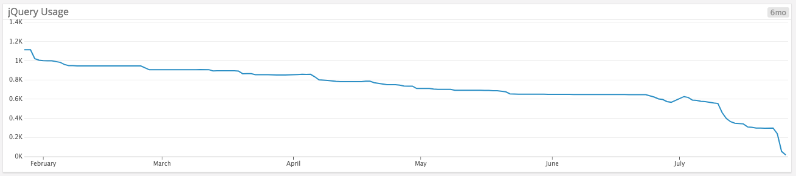

# Introduction

## Frontend development: a quick history

In September 2018, GitHub [announced](https://githubengineering.com/removing-jquery-from-github-frontend/) that it had finally removed the last vestige of jQuery from its codebase. This was a gradual process.

This event seems like an appropriate moment to pause and take a look back at the history of front-end development over the past decade of so.

Ten years doesn't seem like a terribly long passage of time to consider but, from the perspective of the web and especially of front-end development, a decade can seem like an eternity.

Consider what the development landscape of ten years ago looked like. Back then we had

* no Google Chrome
* no standard way to query DOM elements via a CSS selectors
* no standard way to animate the visual styles of an element
* no standard way to make a backend request

Since then, browsers have improved dramatically and more importantly have converged upon a [single living standard](https://html.spec.whatwg.org/dev/). Internet Explorer remains a bit of an outlier with regard to web standards but it is important to note that 

1) Internet Explorer 11 is not a terrible browser and can be polyfilled and transpiled for in order to address most of its deficiencies.

2) worldwide usage of all versions of Internet Explorer on the desktop have plummeted in recent years to less that 10% of all users. Usage continues to drop significantly every year.

As a consequence, an overwhelming majority of desktop users today use what we call “evergreen” browsers, i.e. browsers that get regularly and automatically updated. More importantly, web use is moving increasingly toward mobile devices (where Internet Explorer barely exists) and nearly all mobile users browse with an evergreen browser.

This means that developers would be wise to take these changes into account when thinking about their approach and attitude toward newer features of the web platform. In the past, web developers were forced to ignore newer features of browsers for years after their initial release. Instead they had to develop for the lowest common denominator of browser (this usually meant some version of Internet Explorer). 

This is now no longer the case and developers should really track more closely with the changes that are happening to their platform. This doesn't mean abandoning users of minority browsers but it does open up other ways of dealing with them. It is now becoming increasingly common for developers to create two sets of bundles, ones that target evergreen browsers and the other for non-evergreen browsers. This separation means that code sizes shrink for the modern browsers and not all features need be fully supported for non-evergreens. 

Just because we as developers have a responsibility to not cut off any community of our users, at the same time this doesn't mean that we have to guarantee exactly the same experience. On older browsers some features of our software may be limited or missing altogether. Supporting the weakest browsers **should no longer mean foregoing the benefits of the browsers most people actually use!** We can feature detect the user's browser and provide the experience that is best suited to that browser.

Over the past decade, the browser has become a universal application environment. Instead of being content to simply display HTML pages loaded from a server, most modern web applications now have adopted a "single-page application" architecture in which the browser downloads its static resources from an asset server (possibly a CDN) and fetches its data from a backend server in the form of AJAX requests and JSON payloads (rather than HTML). Modern versions of this architecture include local caching of the application's assets with a service worker and this offers all kinds of benefits, not least to enable the web application to operate even without an internet connection.  

A timeline of the significant events in frontend development history actually stretch back a little bit further than a decade. I'm going to start it in 2004 with the release of GMail, the arguably first modern web application.

* 2004 Google GMail limited beta
* 2004 Firefox released
* 2005 [Jesse James Garrett coins the term “AJAX”](http://adaptivepath.org/ideas/ajax-new-approach-web-applications/) 
* 2007 jQuery released
* 2008 Google releases the Chrome browser
* 2010 Angular released
* 2011 React released
* 2013 Custom Elements v0 
* 2014 Vue.js released 
* 2015 Babel released
* 2015 Redux released 
* 2016 Custom Elements v1 
* 2016 Angular 2 released
* 2018 React dominates

Looking back, I might argue that frontend development passed through three vaguely defined epoch which defined the way we did things. Each epoch is best exemplified by looking at the influence on developer practice of the most dominant library or framework of that era.

### The "jQuery" era (2007 - 2010)

This era was when JavaScript started to be looked upon as a viable language for development. Thanks to the popularising and educational work of Douglas Crockford and others, JavaScript stopped being viewed as some kind of toy language or as a variant of Java and began to be seen as as a powerful and expressive language which had first class functions and closures. 

This was also the time when a lot of work was being put into overcoming browser differences and establishing new norms which would later go on to become web standards. The biggest incompatibilities that needed ironing out were in the areas of Cascading Style Sheets and the Document Object Model.

This was, of course, when JQuery helped programmers to more easily achieve fine-grained control over the DOM and to enable them to add dynamism to every page. 

This sparked a JavaScript revolution. 

### The "Angular" era (2011 - 2015)

While jQuery and similar libraries helped make the browser more accessible and programmable, by 2010 developers started thinking of the browser a programmable application platform. JavaScript was no longer seen merely as an augmentation script for pages delivered by the server. Now the frontend could be seen as an independent system from the backend, a new client/server architecture was developed and named the "single page app" architecture.  

Key to this new way of doing things was to bring the Model-View-Controller approach that was already common in desktop applications and server-side web application frameworks to the frontend. 

Angular slowly emerged during this period and went on to dominate the way web applications were built. What it brought to developers was a declarative way to define the "view" of the application. In Angular, the view could be made of programmable elements called directives (later called components) which could be bound to the model. The controller of the page also had access to this model and could manipulate it but what made Angular's approach novel was that the controller never directly manipulated the view. The view could only be changed by changes in the model. 

The arrival of Angular transformative. Single page apps could use URLs to display different sections of the app without causing a browser refresh. There was no longer any expectation for the backend server to serve HTML. JSON was now the major payload.  

Angular SPAs became dominant but there were less desirable aspects to it. In allowing the model to affect the view, the Angular architecture also allowed the view to affect the model. This is called two-way binding, a cool feature in little apps but one that quickly causes complexity to rise in more complex applications. 

Another problem with Angular, also only apparent at scale, Angular developed performance problems when the number of bindings between model and view increased. Without very special handling, as the number of items to displayed in a view grew (such as with the rows of a table, for example), the amount of computation needs to keep these things in sync. This quickly caused performance to get bogged down, especially on Internet Explorer.

### The "React" era (2016 - )

The solution to these issues for the Angular team was to abandon its own framework and start writing a new one! This eventually led to Angular 2 but it also created an opportunity for other frameworks to come to the fore. Chief amongst those is React.

React at least superficially bears some similarity to Angular in the sense that it has a declarative way of defining the user interface. It has a model to view binding too but this is where the similarity ends. 

React embraces a functional representation of the view which means that the representation of the view is the result of a function where the function takes the application model as its argument. 

    UI = f(model)

If this was all there was to it then then would be a terribly inefficient model because every time the model changed, the end view would need to be reconstructed. In reality, React doesn't reconstruct the entire DOM on every call of a render function. Instead it builds a model of the DOM in memory and when the the model changes it updates this model. It then calculates the difference and from there the smallest number of DOM manipulations that would be required to update the DOM to match the model. This "Virtual DOM" rendering system has proven itself to have been wonderfully successful and has gone on to inspire many other frameworks that also use the Virtual DOM technique.

One of the implications of the view being a function of the model is that this relationship necessarily runs one way. The render function is a pure function and the textbook definition of functional purity is that the function is not permitted to mutate or change its arguments. React apps therefore do not have Angular's two-way binding but as mentioned above, this is actually a good thing. Two-way binding causes more problems than it solves. Because there are multiple sources of change two-way binding can lead to indeterminacy and great difficulty in testing. React apps are more explicit about their relationship to the model and changes to the view that as a consequence of user interaction always come as user events. 

Another consequence of this functional approach to the UI is that components tend to be simpler than their Angular counterparts. While Angular components are often "smart" i.e. have lots of connections and dependencies that enable them to contain a lot of functionality and local state, React components in practice usually have less local state and tend to restrict themselves to presentation and user interaction. These "dumb"-er components communicate via user events up to the containing components. Business logic tends to be handled at that level rather than at the component level. The separation of business logic and presentation logic is one of the innovations of the React architecture.

## The Browser Platform

Meanwhile, during these three "epochs", the browser itself has matured significantly as a platform. Where there once was great variation and incompatibility, now the browsers have converged and have become much more compatible. At the same time the browser has become more powerful as a programming platform.

Under the web standards process, browsers have taken on a bigger API and functionality. Now included in the browser platform are 

* promises — a functional way to deal with asynchronicity. Promises are more powerful than callbacks because they can composed and can handle error conditions in a much less complicated way.
* fetch — a promise-based way to load resources from the backend. 
* querySelector — ability to select elements using CSS selection rules. querySelector and querySelectorAll operate in a similar way to the jQuery selection operations.
* CSS transitions and animations
* history API — change URL without navigating the browser
* web workers
* local storage and indexeddb
* service workers
* custom elements — extending the DOM with components

## What are Custom Elements?

[Custom Elements](https://html.spec.whatwg.org/dev/custom-elements.html) are a feature of modern browsers which allow you to modularise and install your JavaScript components into the browser itself in order to extend it in new and powerful ways. Custom Elements are HTML components which have their own self-contained markup, styling and behaviour.

For example, say we wanted to create an element that formatted a person’s name

    <name-card first-name="John" last-name="Hardy"></name-card>

If the `name-card` tag was registered as a custom element component then the browser could be made to render it as

    <table>
      <tr>
        <th>First Name</th>
        <th>Last Name</th>
      </tr>
      <tr>
        <td>John</td>
        <td>Hardy</td>
      <tr>
    </table>

Custom Elements are useful for defining reusable components such as buttons and drop-down menus but they are expressive enough that they could even constitute entire web pages.

Because they are registered with the browser itself, Custom Elements do not compete with existing libraries and frameworks. In fact they can be used to facilitate greater interoperability and code sharing between them. A custom element designed for, say, an Angular application could be reused in a React application. The work that went into developing the component in one framework could be reused without modification in another. This enables flexibility in web development and it also helps defeat the general tendency towards vendor and framework lock-in on the front-end.

You can think of Custom Elements as a sort of containerisation for web components. They have been designed to maximise flexibility and code reuse.

