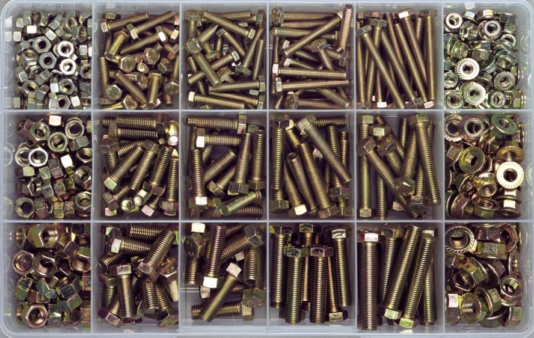

# Introduction

## Front-end development and web standards

In September 2018, GitHub [announced](https://githubengineering.com/removing-jquery-from-github-frontend/) that it had finally removed the last vestige of jQuery on its codebase. This was a gradual process.

This event seems an appropriate moment to pause and look back at front-end development over the past decade of so.

Ten years ago, there was

* no Google Chrome

* no standard way to query DOM elements by a CSS selector

* no standard way to animate visual styles of an element

* no standard way to make an AJAX request

Since that time browsers have converged on a [single living standard](https://html.spec.whatwg.org/dev/)

* Internet Explorer 11 remains an outlier

* Internet Explorer < 10% usage

* The bulk of users today user “evergreen” browsers

* A growing proportion use evergreen browsers on mobile

A timeline of frontend web development

* 2004 Google Gmail released

* [Jesse James Garrett coins the term “AJAX”](http://adaptivepath.org/ideas/ajax-new-approach-web-applications/) 

* 2007 GitHub adopts jQuery

* 2008 Google releases Chrome 

* 2010 Angular JS released

* 2011 React released

* 2013 Custom Elements v0 

* 2016 Custom Elements v1 

* 2018 React dominates

Frontend development has passed through three periods as exemplified by the dominant library or framework of the era

jQuery

* overcoming browser differences

* ability to add dynamism to every page

* unobtrusive JavaScript

* JavaScript revolution

Angular JS

* declarative interfaces using templates and directives

* data binding of the state to the view

* MVC app structure

* app routing

* testing framework

* transformative

React

* functional representation UI = f(state)

* virtual DOM as an optimisation

* unidirectional data flow

* “dumb” components

* state management (Flux, Redux, MobX etc)

Meanwhile, the browser platform itself has also matured

* fetch — ability to load resources without changing the url

* querySelector — ability to select elements using CSS selection rules

* History API — change url without navigating the browser

* Promises — functional way to deal with asynchronicity

* Custom Elements — extending the DOM with components

## What are Custom Elements?

[Custom Elements](https://html.spec.whatwg.org/dev/custom-elements.html) are a feature of modern browsers which allow you to modularise and install your JavaScript components into the browser itself in order to extend it in new and powerful ways. Custom Elements are HTML components which have their own self-contained markup, styling and behaviour.

For example, say we wanted to create an element that formatted a person’s name

    <name-card first-name="John" last-name="Hardy"></name-card>

If the `name-card` tag was registered as a custom element component then the browser could be made to render it as

    <table>
      <tr>
        <th>First Name</th>
        <th>Last Name</th>
      </tr>
      <tr>
        <td>John</td>
        <td>Hardy</td>
      <tr>
    </table>

Custom Elements are useful for defining reusable components such as buttons and dropdown menus but they are expressive enough that they could even constitute entire web pages.

Because they are registered with the browser itself, Custom Elements do not compete with existing libraries and frameworks. In fact they can be used to facilitate greater interoperability and code sharing between them. A custom element designed for, say, an Angular application could be reused in a React application. The work that went into developing the component in one framework could be reused without modification in another. This enables flexibility in web development and it also helps defeat the general tendency towards vendor and framework lock-in on the front-end.

You can think of Custom Elements as a sort of containerisation for web components. They have been designed to maximise flexibility and code reuse.

