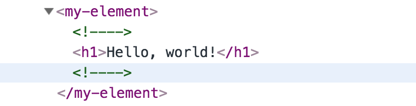
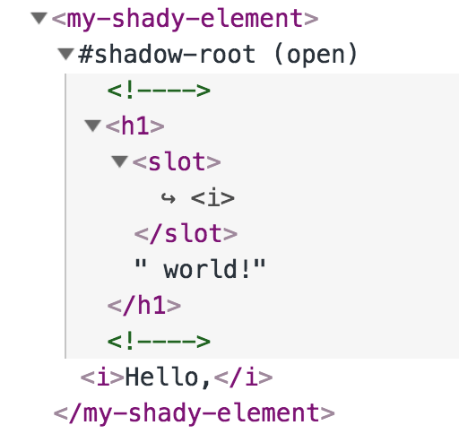
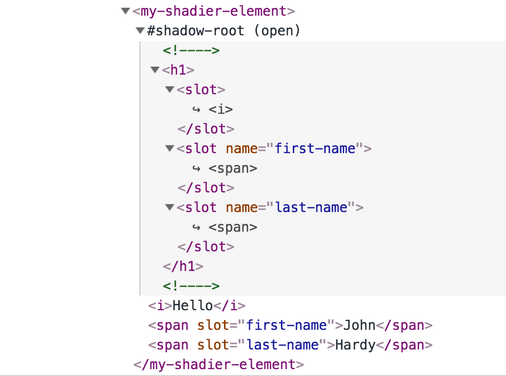

# Chapter 2 - Building Custom Elements

The examples so far have concentrated on selecting some existing DOM element in the HTML page and then replacing its contents with some JavaScript-generated content. This is fine as it goes but what we’re really after is a way to build reusable web components that exist autonomously in the browser. When they appear in the HTML of the page, they become active, know how and when to render themselves and respond to browser events with their own behaviours.

Let’s start with a simple example

    <my-element></my-element>

Note that custom elements must have at least one hyphen in their name. Also note that custom elements always must have a closing tag.

The basic definition of a custom element looks like this.

    class MyElement extends HTMLElement { // 1
      
      constructor() { // 3 
        super();        
      }
      
      connectedCallback() { // 4
        this.render();
      } 
      
      render() { // 5
        render( 
          html`<h1>Hello, world!</h1>`, 
          this
        );
      }
    }

    customElements.define('my-element', MyElement); // 2

[See a working version here (use Chrome).](https://codepen.io/jhlagado/pen/QVPQWb?editors=1101)

Custom elements are made using a JavaScript class definition (1) which is registered with the browser (2).

The class definition must extend one of the built in classes of the browser which implements an element. While it is possible to extend and inherit the behaviours of built-in element types such as `HTMLButtonElement`, this is currently still a poorly supported feature in browsers. Therefore all of the examples here will extend from the generic `HTMLElement`.

In this basic example, I have provided a `constructor` (3) which currently does nothing except call `super`. In this simple example it could have been omitted.

The class definition also provides an implementation a Custom Element life-cycle hook called `connectedCallback` (4) which is called when the element is first added to the document. This callback is a good place to initially update the DOM with new content. In our example it does this by calling its own method `render` (4) which in turn calls the LitHtml `render` method passing a LitHtml literal and the element’s own DOM to render to.

Note: unlike React components the render() method has no special meaning. Deciding when to update the DOM is completely left up to the custom element to decide.

The resulting HTML in the browser looks like this.

While this is already pretty good, it has the downside of the custom element replacing its own body content. This makes it difficult to pass additional information in the body of the custom element.

We can overcome this problem and at the same time unlock even more powerful features of Custom Elements by using another feature of the modern browser platform called the [Shadow DOM](https://developer.mozilla.org/en-US/docs/Web/Web_Components/Using_shadow_DOM).

## Shadow DOM

Any HTML element in the browser act like a tiny universe of its own by having its own Shadow DOM. An element can acquire a `shadowRoot` during its construction phase and this is what it will render to the browser instead of the elements in its body. The body content of the element is invisible therefore and may be used for other purposes such as passing data to the component.

The HTML elements inside the element’s Shadow DOM are isolated from the elements outside and can be styled and controlled independently of everything else on the page.

Given the following custom element

    <my-shady-element>
      <i>Hello</i>
    </my-shady-element>

You can see that it contains HTML children elements in its body. Because this component will be defined to have a Shadow DOM these children elements won’t get displayed directly.

Let’s now turn to the component’s definition and see how we can use a Shadow DOM.

    class MyShadyElement extends HTMLElement {
      
      constructor() { 
        super();
        this.attachShadow({mode: 'open'});   
      }
      
      connectedCallback() {  
        this.render();
      } 
      
      render() { 
        render( 
          html`
            <h1>
              <slot></slot> world!
            </h1>
          `, 
          this.shadowRoot
        );
      }
    }
      
    customElements.define('my-shady-element', MyShadyElement);

[See a working version here (use Chrome).](https://codepen.io/jhlagado/pen/GXLxGm?editors=1101)

When this component gets constructed, it calls its inherited method `attachShadow` and this creates a Shadow DOM for this element and puts the root of this structure in a property called `shadowRoot`. When the `render` function is invoked, unlike in the previous example, it renders to the element’s `shadowRoot` rather than to the element itself.

The resulting HTML in the browser looks a bit different to the previous example

The first thing to notice is that the element has a child marked #shadow-root which contains all the DOM that will be rendered. The actual body of the custom element is not rendered directly but it gets referenced by the Shadow DOM using a special tag called `slot`.

You can think about `slot` as a kind of symbolic link. You can use slots to link to content in the body of the custom element and render it right in the middle of the Shadow DOM. Nothing actually is moved, these are references but the effect is the same as it the DOM elements had been moved.

If you have several items that you want to reference from the body you can use **named slots**. In the following custom element we are passing information through three slots: the default one, a named one called `first-name` and a second one called `last-name`.

    <my-shadier-element>
      <i>Hello</i>
      John
      Hardy
    </my-shadier-element>

In the render method we use slot elements to reference these items of passed in data.

    class MyShadierElement extends HTMLElement {
      
      constructor() { 
        super();
        this.attachShadow({mode: 'open'}); // 1    
      }
      
      connectedCallback() {  
        this.render();
      } 
      
      render() { 
        render( 
          html`
          <h1>
            <slot></slot> 
            <slot name="first-name"></slot> 
            <slot name="last-name"></slot> 
          </h1>
          `, 
          this.shadowRoot
        );
      }
    }
      
    customElements.define('my-shadier-element', MyShadierElement);

[See a working version here (use Chrome).](https://codepen.io/jhlagado/pen/WgWJNa?editors=1101)

## Refactoring Custom Elements

As the complexity of a custom element grows, the amount of HTML to be rendered also tends to increase. This in turn makes our code longer and harder to read and maintain. It may come to a point where it makes sense to decompose our component into smaller components. Decomposition can aid us by improving readability and code reusability.

For example, consider this `my-comment` component which could be used to represent a comment on a blog or social media site.

    class MyComment extends HTMLElement {
      
      constructor() { 
        super();
        this.attachShadow({mode: 'open'});
      }
      
      connectedCallback() {  
        this.render();
      } 
      
      render() { 
        render( 
          html`
          

            

              
              

                ${this.author.name}
              

            

            

              <slot></slot>
            

            

              ${this.date}
            

          

          `, 
          this.shadowRoot 
        );
      }
    }
      
    customElements.define('my-comment', MyComment);

which we will render directly using LitHtml

    const author = {
      name: 'John Hardy',
      avatar: '[https://bit.ly/2OHRT9v](https://bit.ly/2OHRT9v)'
    };

    const date = new Date();
    const text = html`
        

          Hello, this is my comment.
        

    `;
      
    const literal = html`
      <my-comment .author=${author} .date=${date}>
        ${text}
      </my-comment>
    `;

    render(
      literal,
      document.getElementById('root')
    );

[See a working version here (use Chrome)](https://codepen.io/jhlagado/pen/QVPxqK?editors=1101)

You can see that the render method of the custom element is rather long and hard to read. We can do better by decomposing this unwieldy structure into smaller and more reusable components.

Let’s start by extracting the `my-avatar` component

    class MyAvatar extends HTMLElement {
      
      constructor() { 
        super();
      }
      
      connectedCallback() {  
        this.render();
      } 
      
      render() { 
        render( 
          html`
            
          `, 
          this
        );
      }
    }
      
    customElements.define('my-avatar', MyAvatar);

`my-avatar` doesn’t need to know that it is being rendered inside a `my-comment` component. In fact the less it knows about the surrounding context in which it is used the better.

Next, we will extract a `my-user-info` component that renders an `my-avatar` component next to the user’s name

    class MyUserInfo extends HTMLElement {
      
      constructor() { 
        super();
      }
      
      connectedCallback() {  
        this.render();
      } 
      
      render() { 
        render( 
          html`
            

              <my-avatar .user=${this.user}></my-avatar> 
              

                ${this.user.name}
              

            

          `, 
          this
        );
      }
    }
      
    customElements.define('my-user-info', MyUserInfo);

Now let’s us simplify `my-comment`

    class MyComment extends HTMLElement {
      
      constructor() { 
        super();
        this.attachShadow({mode: 'open'});
      }
      
      connectedCallback() {  
        this.render();
      } 
      
      render() { 
        render( 
          html`
          
           
            <my-user-info .user=${this.author}></my-user-info>
            

              <slot></slot>
            

            

              ${date}
            

          

          `, 
          this.shadowRoot
        );
      }
    }
      
    customElements.define('my-comment', MyComment);

[See a working version here (use Chrome)](https://codepen.io/jhlagado/pen/LJvBjY?editors=1101)

